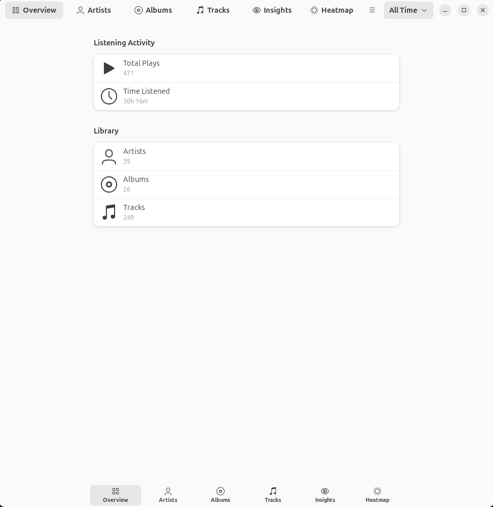
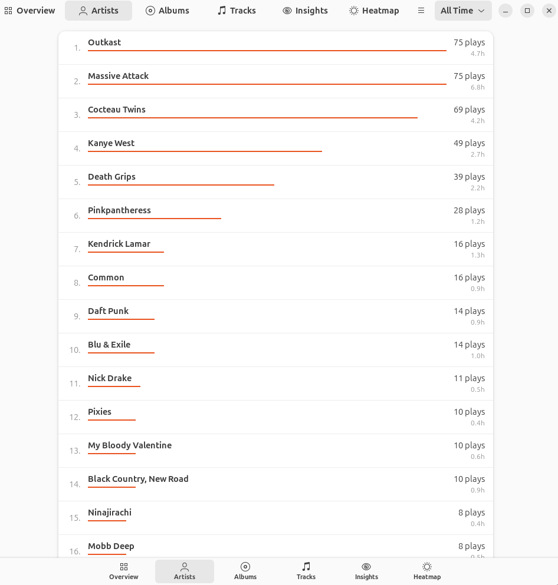

# Niandra

A small and simple music listening tracker for GNOME.



Niandra tracks what you listen to from any MPRIS-compatible music player on your Linux desktop. It quietly runs in the background, storing your listening history locally, and lets you explore your music habits with a clean, native interface.

## What Niandra does

Niandra monitors your music players via D-Bus and records each song you listen to. It captures rich metadata—artist, album, track, duration—and builds a personal listening history that stays on your machine.

The GUI lets you explore:

- **Overview** — Total plays, listening time, library size
- **Top Lists** — Your most-played artists, albums, and tracks
- **Insights** — Listening streaks, night owl score, skip rate
- **Heatmap** — When you listen throughout the day



## What Niandra does not do

Niandra is not a music player. It doesn't manage playlists, edit tags, or stream music. It simply observes what you're already listening to and helps you understand your habits.

Niandra does not upload your data anywhere. Everything stays in a local SQLite database on your computer.

## Installation

### From source

```bash
git clone https://github.com/tombleher/niandra
cd niandra

# Build the GUI
cargo build --release --features gui

# Install
sudo cp target/release/niandra /usr/local/bin/
sudo cp target/release/music-tracker /usr/local/bin/

# Install desktop file for GNOME
cp data/io.github.tombleher.Niandra.desktop ~/.local/share/applications/
```

### Running the tracker

The tracker daemon monitors your music players in the background:

```bash
# Run directly
music-tracker

# Or install the systemd service
cp music-tracker.service ~/.config/systemd/user/
systemctl --user enable --now music-tracker
```

### Dependencies

Build dependencies (Fedora/RHEL):
```bash
sudo dnf install gtk4-devel libadwaita-devel
```

Build dependencies (Debian/Ubuntu):
```bash
sudo apt install libgtk-4-dev libadwaita-1-dev
```

## Why "Niandra"?

The name comes from [*Niandra LaDes and Usually Just a T-Shirt*](https://en.wikipedia.org/wiki/Niandra_LaDes_and_Usually_Just_a_T-Shirt), John Frusciante's 1994 solo album. It was one of my early introductions to music that existed outside the mainstream—raw, personal, and unpolished. This project carries a bit of that spirit: a simple tool for people who care about their music.

## Contributing

Contributions are welcome! Whether it's bug reports, feature suggestions, or pull requests—all are appreciated.

- **Issues**: [github.com/tombleher/niandra/issues](https://github.com/tombleher/niandra/issues)
- **Code**: Fork the repo, make your changes, and open a PR

Please be kind and respectful in all interactions.

## License

Niandra is released under the [MIT License](LICENSE).

Copyright 2025 Tom Bleher
